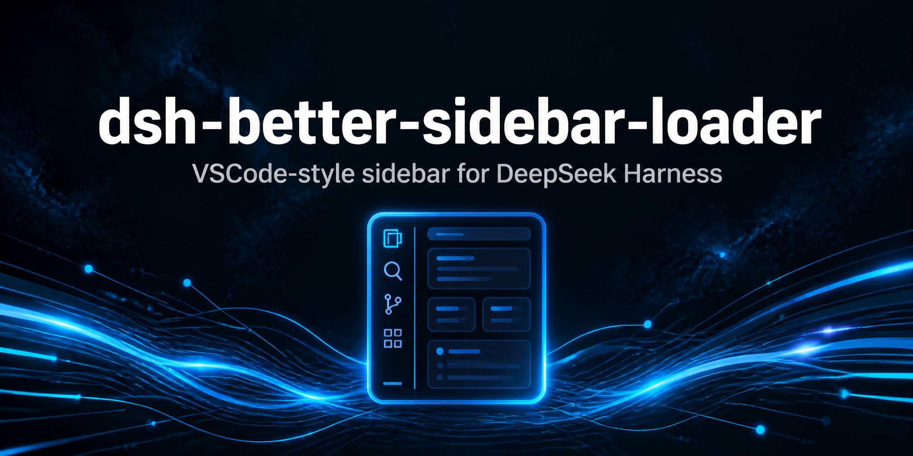

<div align="center">



# @dsh-plugin/dsh-better-sidebar-loader

**一个移植到 dshloader 稳定 API 上的 VSCode 风格右侧边栏（资源管理器 / 编辑器 / 终端 / Git / 浏览器）——主机端零直接 dsh 服务访问、零 `@deepseek-ai/*` 运行时导入。**

[English](README.md) | 简体中文

[](https://github.com/topics/dsh-plugin)
<a href="https://github.com/dsh-plugins/dsh-better-sidebar-loader/actions/workflows/npm-publish.yml">
  
</a>
<a href="https://www.npmjs.com/package/@dsh-plugin/dsh-better-sidebar-loader">
  
</a>
<a href="https://www.npmjs.com/package/@dsh-plugin/dsh-better-sidebar-loader">
  
</a>

</div>

**dsh-better-sidebar**（VSCode 风格右侧边栏：资源管理器 / 编辑器 / 终端 /
Git / 浏览器）的移植版，其**主机半部**仅面向 dshloader 的稳定 API
（`ctx.dshLoader`）编程——主机端零直接 dsh 服务访问、零 `@deepseek-ai/*` 运行时导入。

## API 映射（主机）

| 原版（dsh-better-sidebar） | 本插件（dshloader API） |
| --- | --- |
| `inject = ['webServer','sessions','webRuntime','tools']` | `inject = ['dshLoader']` |
| `ctx.webServer.register({kind:'prefix',...})` | `ctx.dshLoader.web.register(path, handler)` |
| `ctx.webServer.registerUpgrade(...)` | `ctx.dshLoader.web.registerUpgrade({path, handler})` |
| `ctx.inject(['settings'], sctx => sctx.settings.register(...))` | `ctx.dshLoader.settings.register(ns, schema)` |
| `sctx.settings.describe/update` | `ctx.dshLoader.settings`（owner 作用域 get() + 更新 envelope） |
| `ctx.sessions / ctx.webRuntime / ctx.tools` | `ctx.dshLoader.services.get('sessions'/'webRuntime'/'tools')` |
| `ctx.get('jobs'/'agents')` | `ctx.dshLoader.services.get('jobs'/'agents')` |
| `@deepseek-ai/dsh-tools` defineTool | 内联于 `src/loader-compat.ts` |
| `@deepseek-ai/dsh-settings` settingsNamespace / SettingsConflictError | 内联于 `src/loader-compat.ts` |

`ctx.dshLoader.services.get()` 是文档化的逃生通道，用于那些没有专属
loader 覆盖面的服务（sessions / webRuntime / tools / jobs / agents /
invariants）；loader 本身负责解析真正的 dsh 服务名。

## 客户端半部

客户端 bundle 以包名 `@dsh-plugin/dsh-better-sidebar-loader` 注册，并通过
`dsh.client.inject`（平台契约）挂载。每一个 `@deepseek-ai/dsh-client-*`
导入都会被改写为 dshloader 的稳定子路径——`@dsh-plugin/dsh-loader/ui-primitives`、
`/ui-slots`、`/ui-settings`、`/schema-form`、`/runtime`——由 loader 的客户端
适配器在运行时映射到真实包，因此本插件**零 `@deepseek-ai/*` 依赖或导入**（仅
在构建时被擦除的 type-only 声明除外）。构建时的 `CLIENT_EXTERNALS` 列出这些
loader 子路径；package.json 只保留 `@dsh-plugin/dsh-loader` 作为其 dsh 家族
依赖。那两次不注入的 `ctx.get(...)` 调用（remote / conversation）经由
`window.__dshLoader__.services.get(...)` 完成，而声明的注入服务（slots /
sessions / connection / workspaces / locale）与所有官方客户端插件一样，仍然
保留在 cordis 上下文中。

## 构建

```sh
pnpm build   # tsc 类型 + tsdown（主机 + 客户端 bundle + 懒加载 chunk）
```
